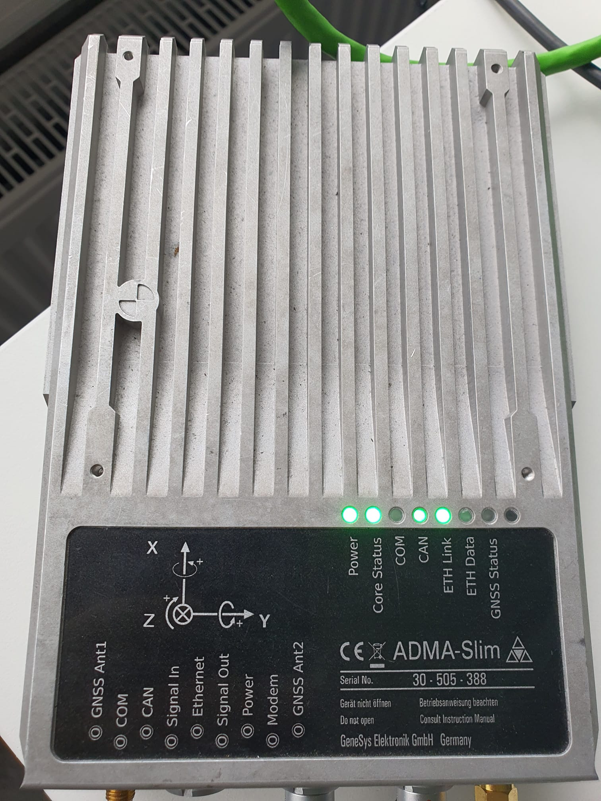
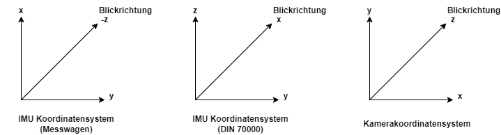
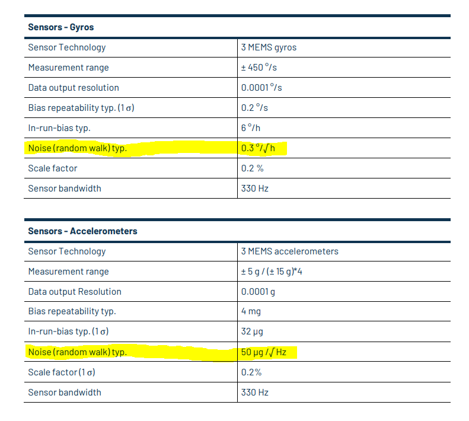

# IMU configuration

## Verwendeter IMU Sensor



## Unterschiedliche Koordinatensysteme




## Intertial Parameter

### Rotations- und Translationsmatrix

Relative Position zwischen IMU und Camera.
4 x 4 Matrix bestehend aus einer 3 x 3 Rotationsmatrix und einem 1 x 3 Translationsvektor:
```
IMU.T_b_c1: !!opencv-matrix
   rows: 4
   cols: 4
   dt: f
   data: [0.0148655429818, -0.999880929698, 0.00414029679422, -0.0216401454975,
         0.999557249008, 0.0149672133247, 0.025715529948, -0.064676986768,
        -0.0257744366974, 0.00375618835797, 0.999660727178, 0.00981073058949,
         0.0, 0.0, 0.0, 1.0]
```

### IMU Rauschparameter

Folgende Parameter sind aus dem Datenblatt der ADMA zu entnehmen:



Oder können durch das Kalibr Tool berechnet werden:

```
IMU.NoiseGyro: 1.7e-4 #1.6968e-04
IMU.NoiseAcc: 2.0000e-3 #2.0e-3
IMU.GyroWalk: 1.9393e-05 
IMU.AccWalk: 3.0000e-03 # 3e-03
IMU.Frequency: 200.0
```

## Kalibriertool

[Kalibr](https://github.com/ethz-asl/kalibr/wiki)
